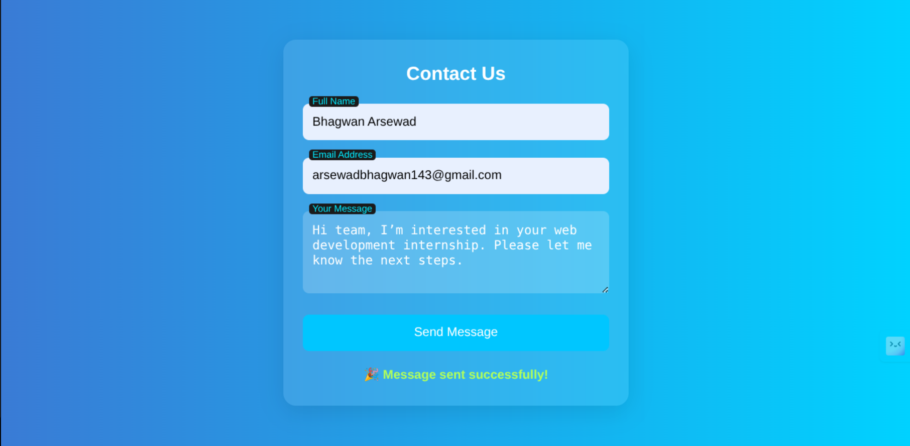

# 📬 Elevate Alabs - Task 6

## 🌟 Task Name:

**Task 6: Create a Contact Form and Validate Inputs Using JavaScript**

---

## 🎯 Objective:

Build a stylish and responsive contact form with **client-side JavaScript validation** for:

* Full Name
* Email Address
* Message

No form submission to a server is required—just validation and user feedback.

---

## 🛠️ Tools Used

* **HTML5**: Form structure
* **CSS3**: Glassmorphism design with responsive layout and animations
* **JavaScript**: Input validation with regex, dynamic error/success messages
* **VS Code** + Chrome for development and testing

---

## 🧩 Folder Structure:

```
elevate-contact-form/
├── index.html       # HTML layout with form
├── style.css        # Theme, animations, responsive styling
└── script.js        # Input validation and feedback
```

---

## 📸 Screenshots




---

## 💡 Features

* Responsive form design (mobile-first)
* Floating labels for clean UX
* Glassmorphism background and smooth UI animations
* Real-time client-side input validation
* Error highlighting using `small` tags
* Success feedback on valid form completion
* Shake animation on validation error

---

## ✅ Validations Implemented

| Field   | Validation Rule                  |
| ------- | -------------------------------- |
| Name    | Required, non-empty              |
| Email   | Required, valid format via regex |
| Message | Required, min 1 character        |

---

## 🧪 How to Test

1. **Open `index.html`** in Chrome.
2. Click Submit without filling → See error messages.
3. Type invalid email → Shows email format error.
4. Enter all fields correctly → Shows green success message.

### 🔍 Sample Valid Input:

* Name: *Bhagwan Arsewad*
* Email: *[bhagwan@example.com](mailto:bhagwan@example.com)*
* Message: *"Interested in the internship program."*

---

## 🚀 How to Run Locally

1. Download the folder or clone from GitHub.
2. Open `index.html` in any modern browser.
3. Test all features interactively (no server required).

---

## 🤝 Author

**Bhagwan Arsewad**
AI & Data Science @ IIT Jodhpur
📧 [b22ai010@iitj.ac.in](mailto:b22ai010@iitj.ac.in)
